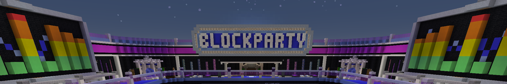
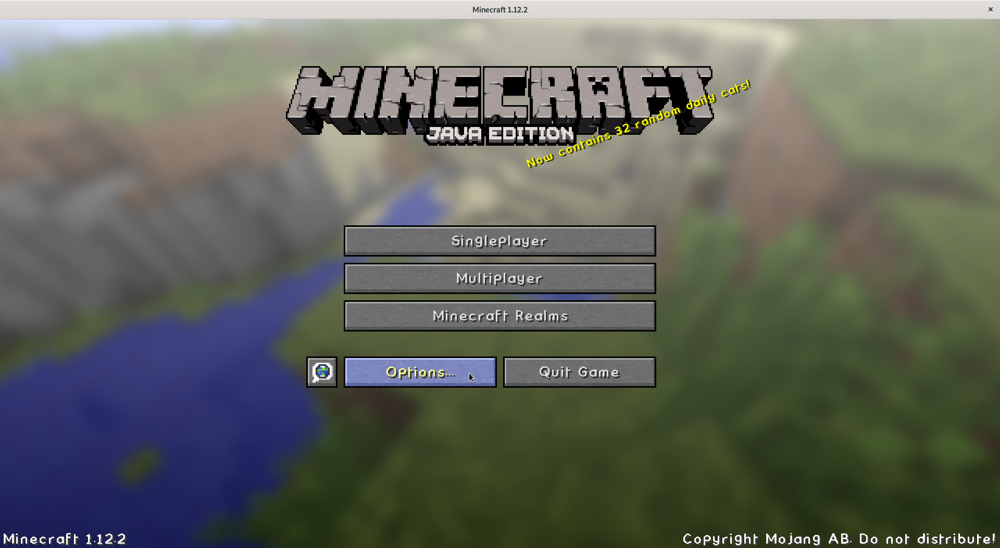
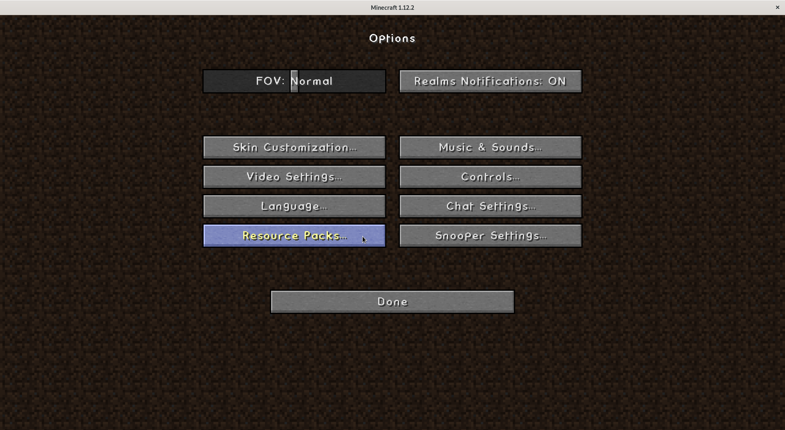
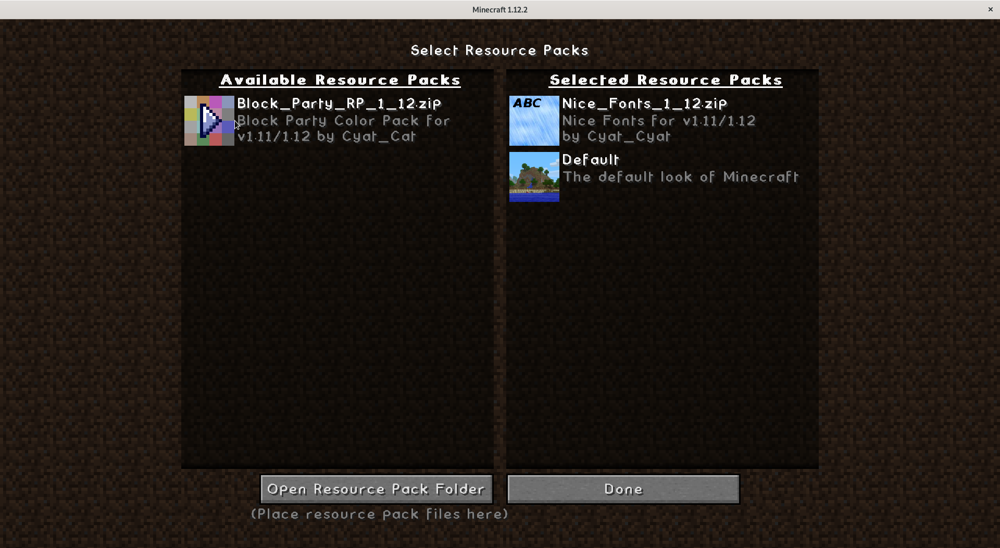

# bp-resourcepack



## A Minecraft Resource Pack for Block Party
Having trouble playing block party?  Getting a lot of F's in the chat?  Does gray look like brown and vice versa?

bp-resourcepack replaces the dull clay textures with brighter and more discernible colors.

## What does it do?
This is very light weight resource pack.  All it does is replace the standard 16 hardened clay block textures with color enhanced versions.  That's it.

## Installation
#### Locate your minecraft resourcepacks folder:
| OS       | Location     |
|----------|:-------------|
| Windows |  %APPDATA%\\.minecraft\resourcepacks |
| macOS   |    ~/Library/Application Support/minecraft/resourcepacks |
| Linux   | ~/.minecraft/resourcepacks |

More details regarding your .minecraft folder can be found here [https://minecraft.gamepedia.com/.minecraft](https://minecraft.gamepedia.com/.minecraft).

####  Copy the zip file of your desired minecraft version from this repo into your resourcepacks folder:

For example:
```
.minecraft\resourcepacks\Block_Party_RP_1_12.zip'
```

####  Start minecraft and go into the options menu


####  Click on the resource packs button


####  Select the resource pack from available list

